# Máster en Big Data y Analítica de Negocio

## IFFE TECH SCHOOL: BIG DATA MANAGEMENT

## Título: Ejercicio voluntario COVID-19

## Tabla de contenidos

<li><a href="#objetivo">Objetivo</a></li>
<li><a href="#file_descriptions">Descripción de los ficheros</a></li>
<li><a href="#questions">Questiones</a></li>
<ul>
    <li><a href="#q1">1.- Cargar datos desde fichero csv.</a></li>
    <li><a href="#q2">2.- Cargar los datos en MySQL. Normalizar los datos creando un modelo en estrella.</a></li>
    <li><a href="#q3_q4">3. y 4. Trabajos en SQL.</a></li>
    <li><a href="#q5">5. Desde R, accede a MySQL y lee los datos.</a></li>
    <li><a href="#q6">6.- Con la libreria dplyr vuelve a calcular el ratio de mortalidad.</a></li>
    <li><a href="#q7">7.- Compara que el dato calculado con R, coincide con el calculado en SQL, creando un vector lógico.</a></li>
    <li><a href="#q8">8.- Calcula en R el dato por País y Provincia con dplyr.</a></li>
    <li><a href="#q9">9.- Grafica con ggplot2 un diagrama de caja (boxplot) del ratio calculado por país.</a></li>
    <li><a href="#q10">10.- Muestra el ratio por país con orden descendente, acompañando el dato del ratio con el número de observaciones con el que se ha calculado.</a></li>
    <li><a href="#q11">11.- Dibuja con geom_line la evolución total del número de Recuperaciones por día.</a></li>
    <li><a href="#q12">12.- Crea una función UDF que realice el cálculo del ratio de mortalidad.</a></li>
    <li><a href="#q13">13.- Usa la función creada en el punto anterior sobre el conjunto de datos con la librería dplyr y la función summarise por cada fecha de observación.</a></li>
    <li><a href="#q14">14.- Modifica la función anterior para que devuelva cual es el ratio de recuperación. ¿Qué cambios hay que realizar?</a></li>
    <li><a href="#q15">15.- Representar en un mapa el número de casos confirmados, muertes y ratio de defunciones.</a></li>
    </ul>

## Objetivo

Este trabajo se ha realizado a modo de práctica dentro del Master de Big Data y Business Analytics impartido por IFFE Business School. Su objetivo es que sirva como introducción al analysis de datos con R, familiarizándonos con la utilización de librerías como deplyr, leaflet, ggplot2, etc. 

* Para ello en primer lugar deberemos descargar el dataset con información sobre los casos de COVID-19 de la siguiente ubicación de [kaggel](https://www.kaggle.com/sudalairajkumar/novel-corona-virus-2019-dataset#covid_19_data.csv).

* Definiremos una base de datos en MySQL con estructura en estrella en la que almacenaremos los contenidos en el dataset.

* Utilizando esta base de datos como referencia se procesará la información y se responderá a las preguntas planteadas en el ejercicio.

## Descripción de los ficheros

* **COVID_19.mwb**: Fichero MySQL Workbench con el diagrama EER de la base de datos utilizada para el almacenamiento del dataset.
* **COVID_19_schema.sql**: Secuancia de comandos SQL generada con MySQL Workbench para la definición de la base de datos.

* **download_files.py**: Script Python para descargar el dataset de su origen utilizando la API de Kaggle.

* **actualiza_coordenadas.py**: Script que, utilizando la API de la página `LocationsIQ`, obtiene las coordenadas de las diferente localizaciones con el objetivo de alamacenarlas y utilizarlas posteriormente en la visualización de mapas.

* **funcionesmysql.r**: Script en R con funciones auxiliares de lectura y escritura de tablas en MySQL.

* **consultas.sql**: Sentencias SQL utilizadas en los puntos 3 y 4.

* **login_credentials.R**: Datos de conexión a la base de datos MySQL.

* **./data/covid_19_data.csv**: Fichero de datos descargado de Kaggle.

* **./data/localizaciones.csv**: Localizaciones obtenidas en la página `LocationsIQ`.

* **./.kaggle/kaggle.json**: Credenciales para la utilización de la API de Kaggle.

* **./pictures/WBM_Covid_19.jpg**: Imagen del diagrama EER usada en la documentación.

* **IFFE_COVID_19.Rmd**: Notebook de R Studio con la solución aportada.

* **FFE_COVID_19.html**: Versión HTML del notebook anterior.

## Questiones:

Este ejercicio se planteó como una serie de questiones que el alumno debía abordar, por lo tanto vamos a enumerar en este documento dichas questiones haciendo un resúmen del planteamiento utilizado en la solución. Hay que tener en cuenta que los comentarios se corresponden con los datos obtenidos al principio de esta pandemia, cuando se realizó el trabajo.

### 1.- Cargar datos desde fichero csv.

Para obtener el fichero se ha utilizado la [API de kaggle](https://www.kaggle.com/docs/api), de este modo se podrá acceder a la versión más reciente. La descarga y descompresión del fichero .zip en un fichero .csv se ha realizado ejecutando un script en Python: `download_files.py`. Se hace además una exploración general de los datos: formato de los datos, número de paises y regiones, valores nulos o sin información, etc.

### 2.- Cargar los datos en MySQL. Normalizar los datos creando un modelo en estrella.

Se ha definido un modelo en estrella sencillo que se puede ver en el fichero adjunto de WorkBench `MySQL COVID_19.mwb`. 
Ésta es una imágen del diagrama EER:

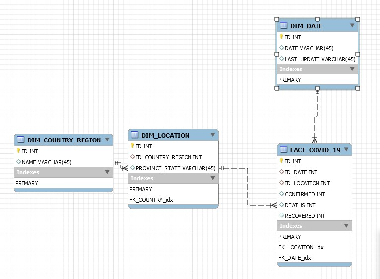

A continuación hemos procedido a la inserción de los datos en las tablas, para ello hemos utilizado la librería `data.table` y la función `escribemysqltable` contenida en el script `funcionesmysql.r`.

### 3. y 4. Trabajos en SQL.

* **Mediante SQL obtener el total de casos positivos confirmados por país.**

* **Mediante SQL calcular el ratio de mortalidad del virus como 100 * Numero de fallecidos / Numero de Confirmados.**

* **Almacena este dato en la misma tabla que has creado para guardar los datos. Usa ALTER TABLE y UPDATE.**

En esta parte se han utilizado las consultas SQL contenidas en el fichero `consultas.sql`.  Estas consultas se han ejecutado tanto desde el propio MySQL Workbench como utilizando la función `sendmysqlquery` contenida en el script `funcionesmysql.r`.

### 5.- Desde R, accede a MySQL y lee los datos.

Utilizamos la función `leemysqltable` que hemos definido en `funcionesmysql.r` para cargar los datos en el data frame `df_SQL_data `.

### 6.- Con la libreria dplyr vuelve a calcular el ratio de mortalidad.

Repetimos los cálculos realizados en el apartado 4, pero en esta ocasión usando la librería deplyr y los datos contenidos en el fichero que previamente hemos cargado en el data frame `df_R`.

### 7.- Compara que el dato calculado con R, coincide con el calculado en SQL, creando un vector lógico.

Comparamos los datos de ratio de mortalidad contenidos en ampos dataframes: `df_SQL_data ` y `df_R`. Vemos que los datos son prácticamente idénticos, pero hay una pequeña diferencia en la aproximación del séptimo decimal. Parece que los cálculos realizados con deplyr aproximan un decimal más. Para realizar la comparación de los resultados ejecutamos el comando:

    sum((diferencia$df_R.Deaths_Rate - diferencia$df_SQL_data.DEATHS_RATIO) > 0.000001)

### 8.- Calcula en R el dato por País y Provincia con dplyr.

En esta parte hemos recontruido la información con los datos que tenemos en las tablas de MySQL y las hemos cargado de nuevo en un dataframe que llamaremos `df_MySQL`. Podríamos utilizar directamente la información del dataframe cargado desde el fichero csv, pero he preferido hacerlo de ese modo para probar el acceso a datos de MySQL desde R.

Sobre ese dataframe hemos usado la librería deplyr para agrupar por país y por provincia.

    df_pais <- df_MySQL %>% 
               group_by(COUNTRY_REGION) %>% 
               summarise(NMEASURES = n(),
                         DEATHS_RATIO = mean(DEATHS_RATIO_SQL)) %>% 
               arrange(desc(DEATHS_RATIO))
               
               
### 9.- Grafica con ggplot2 un diagrama de caja (boxplot) del ratio calculado por país.

Los datos del fichero original son valores acumulados y están guardados por día, región, provincia, etc. Para calcular esta gráfica hemos preferido seleccionar los valores más recientes para cada país y provincia ya que acumulan el total histórico. A continuación sumamos los valores para todas las provincias de cada país y calculamos los ratios con el total de casos confirmados y defunciones por país.

El resultado ha sido el siguiente:

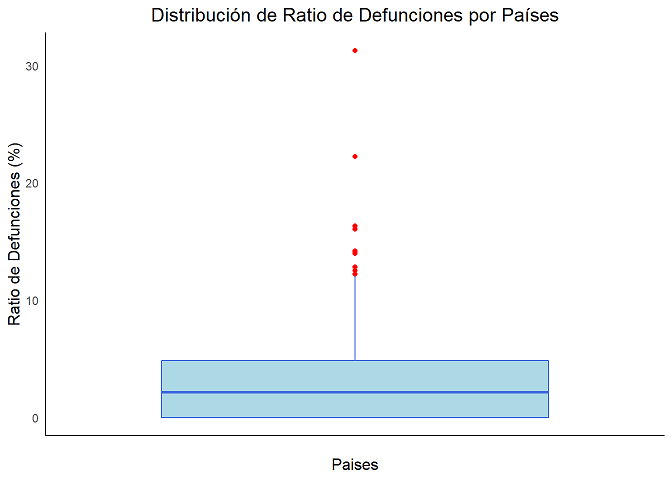

También hemos representado un histograma con el ratio de defunciones por países:

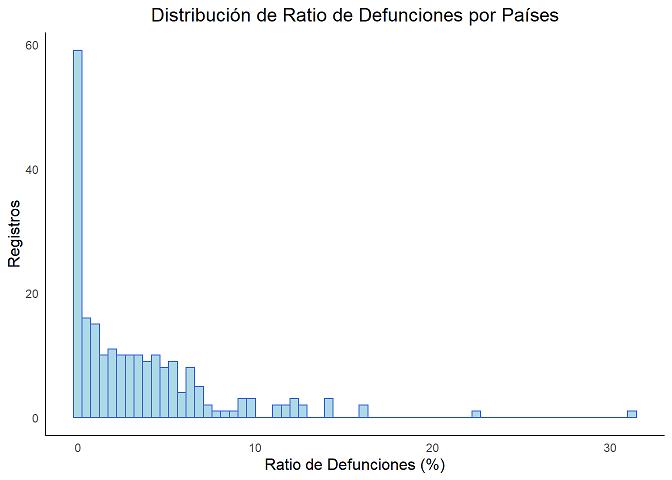

También hemos repetido el proceso, pero realizando los cálculos por provincia en lugar de por país. No incluiremos en este documento las gráficas porque son bastante similares a las obtenidas por paises.

Lo que hemos observado en las distribuciones es que una gran cantidad de provincias y países tienen un porcentage de defunciones del 0%, seguramente porque existen muy pocos casos registrados en esas regiones. Para tener una idea un poco más fiel de la distribución del ratio de defunciones hemos probado a eliminar aquellas provincias con menos de 100 casos y lo países con menos de 500 casos, ya que probablemente sus ratios no tienen gran significancia estadística.

La distribución obtenida den este caso para los países ha sido la siguiente:

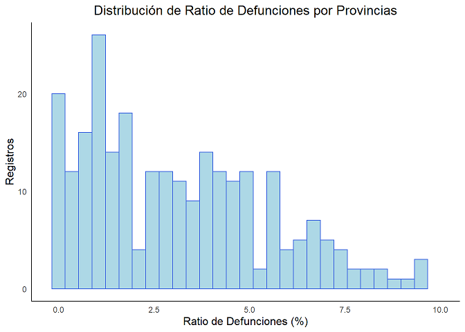

### 10.- Muestra el ratio por país con orden descendente, acompañando el dato del ratio con el número de observaciones con el que se ha calculado.

Esto es básicamente lo que hemos almacenado dentro del dataframe pais. Volvemos a printarlo. Con el sistema que hemos utilizado el número de observaciones se correspondería con el número de provincias porque sólo nos hemos quedado con la observación más reciente, poque se supone es la suma acumulada de todos los casos hasta esa fecha en esa provincia.

No todos los países tienen información desglosada por provincias, pero un BoxPlot interesante podría ser ver cómo es la distribución del ratio de defunciones por provincia para aquellos países que desglosan su información en varias provincias. Nos quedaremos también con las provincias con más de 10 casos. 

Finalmente obtenemos una lista de 9 países:

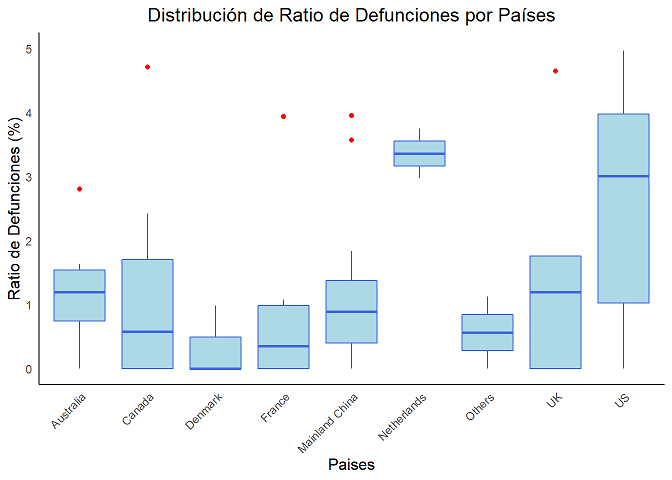

Vemos que hay un país que se llama Others. Realmente se trata the dos dos cruceros en los que se han detectado casos. Parece que Holanda y Estados Unidos son los países con una mediana más elevada. El problema de este gráfico es que tenemos muy pocas muestras por pais (provincias o regiones) para la mayor parte de los países, por lo tanto hablar de quantiles o mediana no tiene mucho sentido. Se podrían comparar los casos de China y Estados Unidos porque sí que tienen un número razonable de muestras.

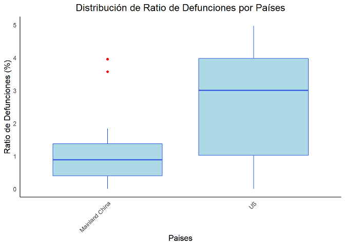

Observando el histograma con la distribución de los datos vemos que también es bastante diferente:

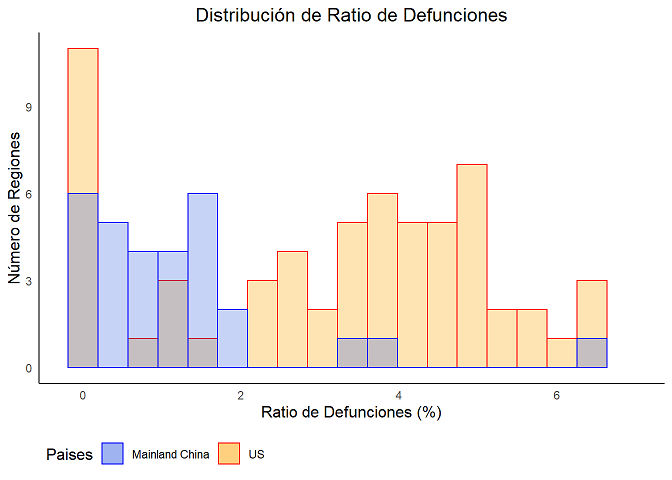

### 11.- Dibuja con geom_line la evolución total del número de Recuperaciones por día.

En este caso hemos preferido representar la evolución de las recuperaciones totalas, las ocurridas en China y las ocurridas en el resto del mundo:

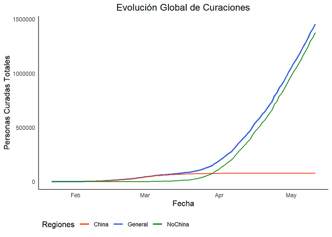

También se ha representado en escala logarítmica en el eje y:

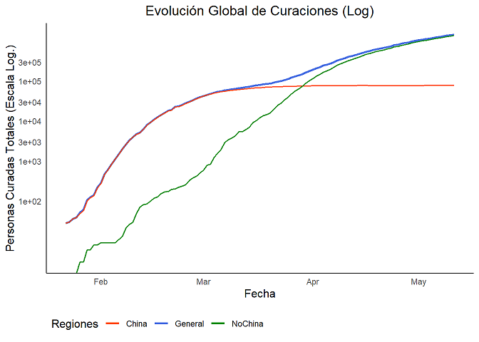

Para finalizar hemos representado también la evolución de la tasa de curaciones y de la tasa de defunciones:

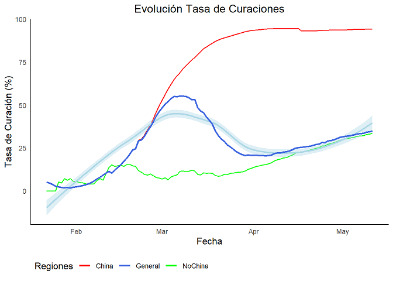

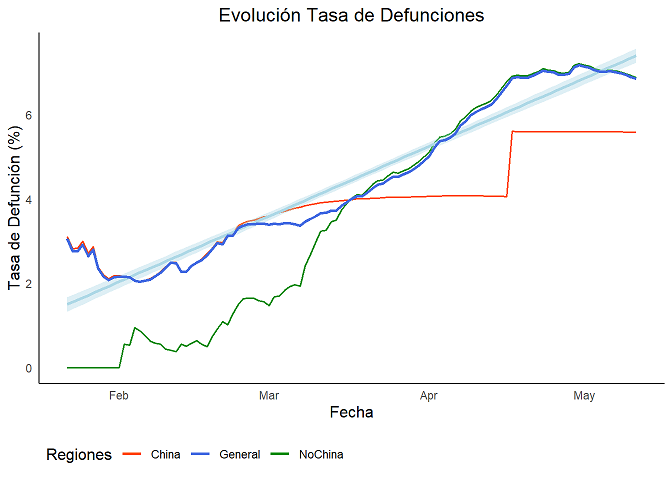

### 12.- Crea una función UDF que realice el cálculo del ratio de mortalidad.

**Sobre el calculo de mortalidad realizado cree una cadena de texto que indique “Para el día: ##/##/#### el ratio es ##,###” (sustituyendo las # por sus valores correspondientes). La función debe admitir 3 parametros, la fecha , el numerador del ratio y el denominador del ratio.**

Se añadió además una variable para que nos devuelva el valor o la frase con el resultado en función de para qué la vayamos a usar. Si printado es igual a TRUE devolverá una cadena de texto del tipo “Para el día: ##/##/#### el ratio es ##,###”, si es igual a FALSE devolverá solo el valor del resultado.

Se definión la siguiente función:

     #función para calcular el ratio entre dos factores
     calcula_ratio <- function(fecha, numerador, denominador, printado = FALSE)
     {
        if (as.integer(denominador) != 0)
        {
          ratio = as.integer(numerador) / as.integer(denominador) * 100
        }
        else
          {
            ratio = 0
          }
       if (printado == TRUE) {
           return(cat("Para el día:", fecha, "el ratio es:", round(ratio, digits=2), "%", '\n'))
       }
       else{
           return(ratio)
       }
  
     }

Y se aplicó sobre 20 tuplas aleatorias del siguiente modo:

    apply(df_date[sample(nrow(df_date), 20),],
      1,
      function(x) calcula_ratio(x['DATE'], x['DEATHS'], x['CONFIRMED'], printado = TRUE))
      
      
 
### 13.- Usa la función creada en el punto anterior sobre el conjunto de datos con la librería dplyr y la función summarise por cada fecha de observación.

Usamos la misma función. En este caso ponemos printado=FALSE para que sólo devuelva el valor con el resultado.

    df_date <- df_MySQL %>% group_by(DATE) %>% 
       summarise(NMEASURES = n(),
                 CONFIRMED = sum(CONFIRMED_SQL),
                 DEATHS = sum(DEATHS_SQL),
                 RECOVERED = sum(RECOVERED_SQL),
                 DEATH_RATIO = calcula_ratio(DATE, DEATHS, CONFIRMED, printado = FALSE))

 
### 14.- Modifica la función anterior para que devuelva cual es el ratio de recuperación. ¿Qué cambios hay que realizar?

Solamente hay que modificar las columnas que se entregan a la función que hemos creado.

    df_date <-  df_MySQL %>% group_by(DATE) %>% 
       summarise(NMEASURES = n(),
                 CONFIRMED = sum(CONFIRMED_SQL),
                 DEATHS = sum(DEATHS_SQL),
                 RECOVERED = sum(RECOVERED_SQL),
                 RECOVERED_RATIO = calcula_ratio(DATE, RECOVERED, CONFIRMED, printado = FALSE))

 
### 15.- Representar en un mapa el número de casos confirmados, muertes y ratio de defunciones.

Para realizar esta parte hemos elavorado un Script en python que lee el fichero de datos, obtiene una lista con todas las ubicaciones y envía consultas a la API de la página https://locationiq.com/ para obtener las coordenadas de esas localizaciones. Se ha escogido esta página porque permite 10000 consultas gratuitas diarias.

El resultado se guarda en un fichero csv `localizaciones.csv` dentro del directorio `data`.

Los campos de texto que se usan para la búsqueda son `PROVINCE_STATE` y `COUTRY_REGION`. Las cooredenadas obtenidas tras la consulta son bastante exactas en general, aunque es verdad que en algunos casos el resultado obtenido no es el correcto. Sería necesario algún tratamiento adicional de estas cadenas de texto para evitar en la medida de lo posible errores de ubicación. Como este trabajo no pretende ser absolutamente exaustivo, si no que la intención es desarrollar mapas con la librería leaflet lo hemos dajado por el momento. De todos modos la gran mayoría de las ubicaciones están correctamente situadas.

Se ha diseñado un mapa en el que hemos añadido una capa de controlos, `base layers`,  para seleccionar el tipo de mapa y una capa de controls, `overlay layers`, para seleccionar el dato que queremos mostrar. Este es el resultado:

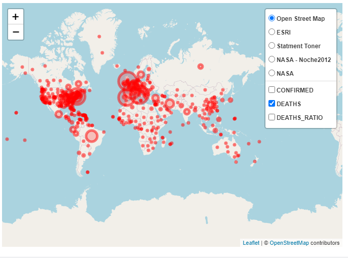